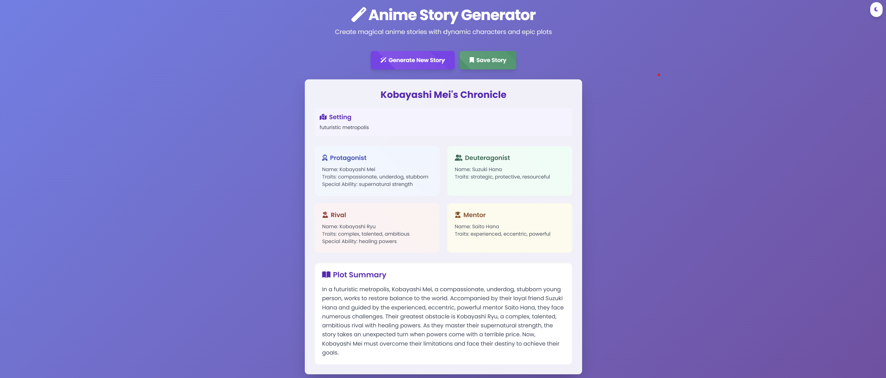

<div align="center">

# 🌟 Anime Story Generator

[](src/static/images/interface.png)

### Generate unique anime stories with dynamic characters, epic plots, and magical settings!

[](https://opensource.org/licenses/MIT)
[](https://www.python.org/)
[](https://flask.palletsprojects.com/)
[](http://makeapullrequest.com)

[Features](#-features) •
[Quick Start](#-quick-start) •
[Usage](#-usage) •
[Development](#-development) •
[License](#-license)

</div>

## ✨ Features

- 🎮 **Interactive Web Interface** - User-friendly story generation
- 🎯 **Dynamic Stories** - Unique plots and twists every time
- 👥 **Rich Characters** - Deep character development with traits and abilities
- 🌍 **Diverse Settings** - From magical academies to futuristic cities
- 💾 **Save & Export** - Keep your favorite stories
- 🌓 **Dark/Light Theme** - Comfortable viewing any time
- 📱 **Responsive Design** - Works on desktop and mobile
- 🔄 **Real-time Generation** - Instant story creation

## 🚀 Quick Start

```bash
# Clone the repository
git clone https://github.com/yourusername/anime-generator.git
cd anime-generator

# Create and activate virtual environment
python -m venv venv
source venv/bin/activate  # On Windows: venv\Scripts\activate

# Install dependencies and package
pip install -r requirements.txt
pip install -e .

# Start the application
python src/app.py
```

Then open http://localhost:5000 in your browser! 🎉

## 💻 Usage

### Web Interface

1. Visit http://localhost:5000
2. Click "Generate New Story"
3. Save interesting stories
4. Export your collection

### Python API

```python
# Simple usage
from src.generator import generate_and_print_story
story = generate_and_print_story()

# Advanced usage
from src.generator import AnimeStoryGenerator

generator = AnimeStoryGenerator()
story = generator.generate_story()

print(f"Title: {story['title']}")
print(f"Protagonist: {story['characters']['protagonist']['name']}")
print(f"Plot: {story['plot_summary']}")
```

## 🏗️ Project Structure

```
anime-generator/
│
├── src/
│   ├── static/
│   │   ├── css/
│   │   │   └── styles.css
│   │   ├── js/
│   │   │   └── main.js
│   │   └── images/
│   │       └── interface.png
│   │
│   ├── templates/
│   │   └── index.html
│   │
│   ├── __init__.py
│   ├── generator.py
│   ├── app.py
│   └── config.py
│
├── tests/
│   └── test_generator.py
│
├── examples/
│   └── basic_usage.py
│
├── .github/
│   └── workflows/
│       └── python-package.yml
│
├── setup.py
├── requirements.txt
├── README.md
├── MANIFEST.in
├── LICENSE
└── .gitignore
```

## 🛠️ Development

```bash
# Install dev dependencies
pip install -e ".[dev]"

# Run tests
pytest

# Code formatting
black .
flake8

# Start development server
python src/app.py
```

## ⚡ Story Generation

Each story includes:
- 📌 **Title** - Unique story name
- 🌍 **Setting** - Story world and context
- 👥 **Characters**
  - Protagonist with special abilities
  - Supporting characters
  - Rival character
  - Mentor figure
- 📜 **Plot Summary** - Main story arc

## 🤝 Contributing

Contributions are welcome! Please feel free to submit a Pull Request.

1. Fork the repository
2. Create your feature branch (`git checkout -b feature/AmazingFeature`)
3. Commit your changes (`git commit -m 'Add some AmazingFeature'`)
4. Push to the branch (`git push origin feature/AmazingFeature`)
5. Open a Pull Request

## 📝 License

This project is licensed under the MIT License - see the [LICENSE](LICENSE) file for details.

---

<div align="center">

### Like this project? Give it a ⭐ to show your support!

</div>
